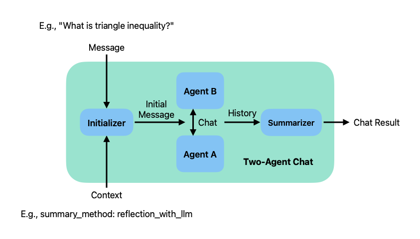
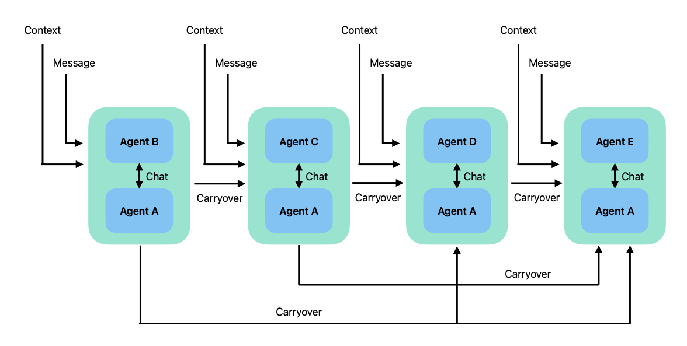
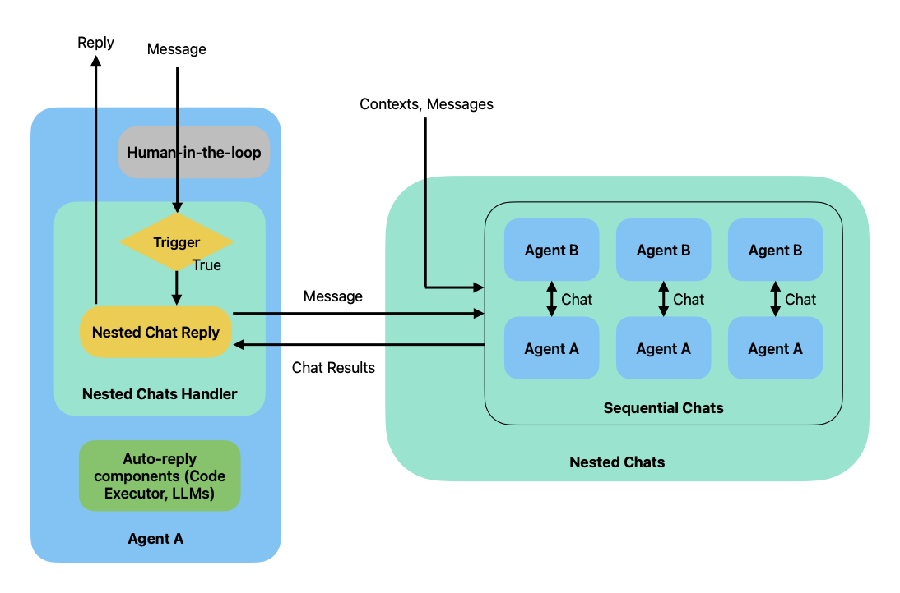
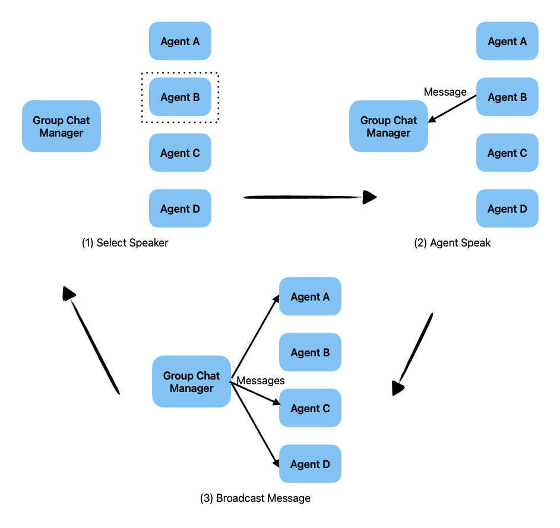
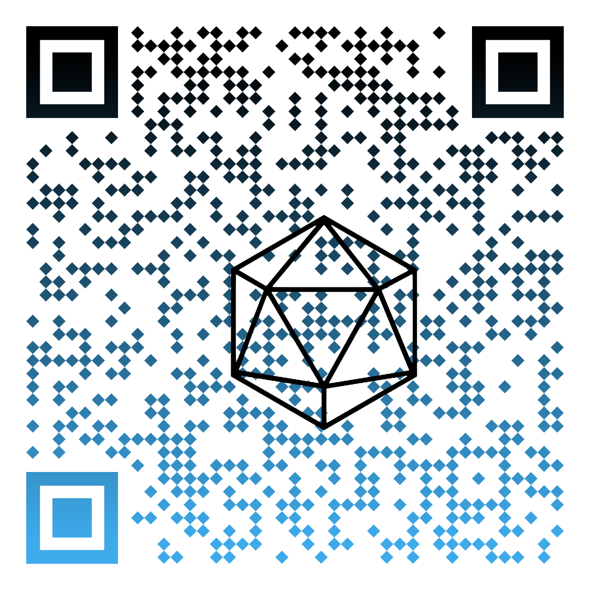
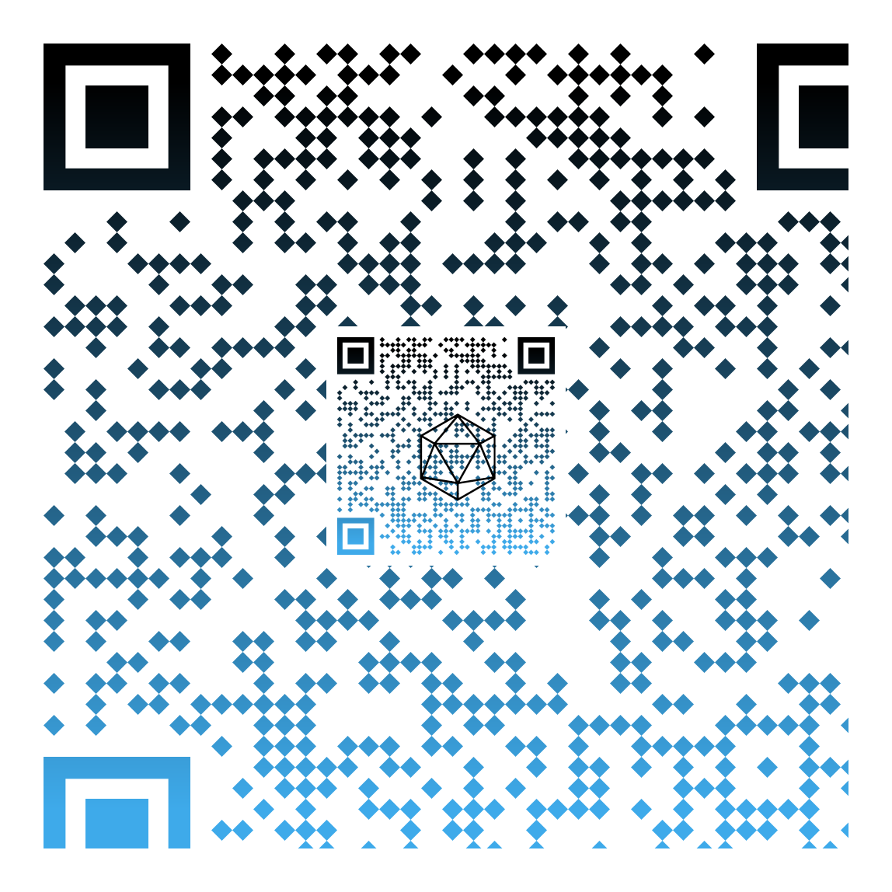

# What is autogen and ag2?

It's framework to build autonomous multi agent systems.

---

# Autogen and it's forks

Autogen started as open source project by microsoft, hosted as [microsoft/autogen](https://github.com/microsoft/autogen). 
Autogen 2 is fork created by initial authors as separate organization called [ag2ai](https://github.com/ag2ai/ag2). 

---

# Currently there are 5 autogen related PyPi Packages
- [ag2ai inherited](https://www.linkedin.com/posts/chi-wang-autogen_github-ag2aiag2-ag2-formerly-autogen-activity-7262922853312802818-WHp7/?utm_source=share&utm_medium=member_android) packages `autogen`, `pyautogen` and added new alias  `ag2` all pointing to the same code base.
- ag2ai's Autogen 2 0.4 was released recently 
- Legacy MS autogen package is `autogen-agentchat~=0.2` [maintained as branch of original repo](https://github.com/microsoft/autogen/tree/0.2)
- [New MS Autogen 0.4 is not backwards](https://microsoft.github.io/autogen/0.2/blog/2024/10/02/new-autogen-architecture-preview/) compatible with 0.2 is available as `autogen-core` and `autogen-agentchat==0.4.0.dev6`
- Microsoft plans to merge MS autogen 0.4 with [semantic kernel](https://devblogs.microsoft.com/semantic-kernel/microsofts-agentic-ai-frameworks-autogen-and-semantic-kernel/)

---

# What makes ag2 stand out compared to other multi agent frameworks?

Compared to Prompt Flow AutoGen emphasizes Agents communicate by sending and receiving messages, enabling intricate interactions.
**PromptFlow** is designed to [link LLMs, prompts, Python code and other tools together in a executable workflow](https://microsoft.github.io/promptflow/)

**LangChain** is focused on component Chaining: building applications by connecting together components like prompts, LLMs, and tools. It creates structured chains with deterministic logic and branching. 

**Autogen** gives agents more autonomy, within pre-defined conversation patterns.

---

# Some of coolest features

- **Conversation Patterns**: Autogen provides a set of conversation patterns that can be used to model the interactions between agents. It's the main topic of today's presentation.

- **Code executors**: Autogen agents can either call only pre-defined registered functions, or just write the code and execute it. It's very powerful but risky feature.

- **Human in the loop**: User can be part of the conversation, and can be asked to provide some information or make a decision.

---

# Multi-agent and multi-model

Documentation of ag2 provides a lot of examples how to use ag2 with Azure, but it's not limited to Azure. It can be used with any other cloud provider or even on-premises. There are instructions for [Non-Open AI Models](https://ag2ai.github.io/ag2/docs/topics/non-openai-models/about-using-nonopenai-models/), [Anthropic Claude](https://ag2ai.github.io/ag2/docs/topics/non-openai-models/cloud-anthropic/), [Amazon Bedrock](https://ag2ai.github.io/ag2/docs/topics/non-openai-models/cloud-bedrock/), [Google Gemini](https://ag2ai.github.io/ag2/docs/topics/non-openai-models/cloud-gemini/) as well as [locally ran open source models with ollama](https://ag2ai.github.io/ag2/docs/topics/non-openai-models/local-ollama/) 

---

# That's right, you can run multi agent system on your laptop

- You can experiment with multi agent system on your laptop.
- You don't need to pay for any external APIs.
- You don't need to pay for any cloud services.
- Some models consume surprisingly low amount of resources (for example gemma2).

---

# Conversation Patterns - Two Agents

The simplest conversation pattern in Autogen involves two agents interacting with each other. 

Example: RPG Game
- Game Master 🎲 - leads the story, creates world and monsters
- Player Character 🤺 - plays as orc barbarian with a big stone axe

Key Features:
- Each agent has defined role (system_message)
- Memory retention between interactions  
- Turn-based conversation flow
- Configurable maximum conversation turns

---



---

Code Example:
```python
player = ConversableAgent(
    name="player",
    system_message="You play as orc barbarian...",
    llm_config=llm_config
)

game_master = ConversableAgent(
    name="game_master", 
    system_message="You are game master...",
    llm_config=llm_config
)

chat_result = game_master.initiate_chat(
    recipient=player,
    message="You wake up inside volcano..."
)
```
---

# Conversation Patterns - Sequential 👤💬➡️📝➡️📊➡️🌐➡️👤

In this pattern, the conversation is split into multiple stages, with each stage involving a different agent in a predefined sequence.

Example: Business Strategy Update
- Everyday Assistant 📝 - Gathers basic company info, asks about status
- Strategy Agent 📊 - Reviews business plans & OKRs 
- Domains Agent 🌐 - Explores different business areas

---



---

# Sequential Pattern Implementation

```python
chats = [
    {
        "sender": everyday_assistant_agent,
        "recipient": customer_proxy_agent,
        "message": "Could you remind me name, stage, and industry?",
        "max_turns": 2
    },
    {
        "sender": strategy_agent, 
        "recipient": customer_proxy_agent,
        "message": "Shall we update our strategy?",
        "max_turns": 1
    },
    {  
        "sender": customer_proxy_agent,
        "recipient": domains_agent,
        "message": "Let's look at other domains",
        "max_turns": 1
    }
]

chat_results = initiate_chats(chats)
```
---

# Conversation Patterns - Nested 💡➡️🤖➡️👨‍👩‍👧‍👦

In this pattern, the first agent receives a task and then consults with multiple specialized agents in a nested way. The agents form a hierarchical structure, with feedback flowing back up to improve the initial plan.

Example: Gaming Startup Evaluation
- Founder 💡 - Creates initial concept
- Expert Team 👨‍👩‍👧‍👦 - Reviews and provides feedback:
  - Team Lead Analyst 📊
  - Pre Mortem Analyst 💀
  - Lawyer ⚖️
  - Potential Investor 💰
  - Chief Editor 💻

---


---

# Nested Pattern Implementation

```python

team_lead_analyst.register_nested_chats(
    review_chats,
    trigger=founder,
)

```

---

# Conversation Patterns - Group Chat 👤💬🤖💬👥

Most complex pattern where multiple agents interact in a group setting, similar to a Discord channel or team meeting.

Example: GenAI Meetup Planning
- Admin 👤 - Chat owner, can ban members
- Moderator 🛡️ - Keeps discussion on topic
- Newsman 📰 - Fetches the latest AI news
- Johnnie 🤖 - AI enthusiast
- Ola 🔬 - RAG specialist
- Janusz 😈 - The troublemaker

---


---
# Group Chat Implementation 🤖💬👥

```python
groupchat = autogen.GroupChat(
    agents=[user_proxy, johnnie, janusz, newsman, moderator, ola],
    messages=[],
    max_round=10,
    allowed_or_disallowed_speaker_transitions={
        user_proxy: [johnnie, janusz, newsman, moderator, ola],
        johnnie: [user_proxy, newsman],
        janusz: [user_proxy, moderator, ola],
        # ... more transitions
    },
    speaker_transitions_type="allowed",
)

manager = autogen.GroupChatManager(
    groupchat=groupchat, llm_config=gpt_4o_mini_config
)

groupchat_result = user_proxy.initiate_chat(
    manager,
    message=task,
)
```
---
# Autogen Studio

It's low code environment to create autogen workflows.
- [Autogen Studio is part of MS Autogen ecosystem](https://github.com/microsoft/autogen/tree/main/python/packages/autogen-studio)
- [ag2ai team has creating new ui for ag2 on their roadmap](https://github.com/ag2ai/ag2/issues/29)
---


# QR Code to repo used during live coding

<div style="
  display: flex;
  justify-content: center;
  align-items: center;
  height: 80vh;
">
  
</div>

---

# Follow us on LinkedIn

<div style="
  display: flex;
  justify-content: center;
  align-items: center;
  height: 80vh;
">
  
</div>


https://www.linkedin.com/company/exegov-ai/
